# Ticketbook — a bus ticket booking system

A Rails application for searching buses, holding seats for five minutes, and
confirming a booking — built so that **two people can never buy the same seat**,
and **refreshing the page can never create a second booking**.

Ruby 3.3.6 · Rails 7.2 · PostgreSQL 16 · Redis · Sidekiq · Hotwire · Tailwind

---

## Contents

1. [How to run it](#1-how-to-run-it)
2. [What it does, with screenshots](#2-what-it-does-with-screenshots)
3. [How two people cannot get the same seat](#3-how-two-people-cannot-get-the-same-seat)
4. [How a refresh cannot double-book](#4-how-a-refresh-cannot-double-book)
5. [How a hold expires](#5-how-a-hold-expires)
6. [Cancellation and refund](#6-cancellation-and-refund)
7. [Rescheduling](#7-rescheduling)
8. [Caching, and how the cache is cleared](#8-caching-and-how-the-cache-is-cleared)
9. [Database design](#9-database-design)
10. [How the code is organised](#10-how-the-code-is-organised)
11. [Tests](#11-tests)

---

## 1. How to run it

Everything runs in Docker. You only need Docker installed.

```bash
git clone <this repo>
cd ticketbook

docker compose build
docker compose run --rm web bin/rails db:prepare db:seed
docker compose up
```

Open **http://localhost:3000**.

Sign in with any email address — there is no password. The app emails you a
sign-in link, and in development the email is **not actually sent**; you read it
at **http://localhost:3000/letter_opener** and click the link there.

Seed data gives you 5 cities, 4 operators, 8 buses, 12 drivers and about 130
departures over the next 7 days.

| URL | What it is |
|---|---|
| http://localhost:3000 | The app |
| http://localhost:3000/letter_opener | Your sign-in emails |
| http://localhost:3000/sidekiq | Background jobs (hold expiry) |

**Run the tests:**

```bash
docker compose run --rm web bundle exec rspec
```

**Watch the concurrency protection work:**

```bash
docker compose run --rm web bin/rails concurrency:check
```

This starts 12 real threads that all try to take the same seat at the same
moment, and shows you that exactly one wins.

---

## 2. What it does, with screenshots

### Sign in with just an email

No password. You type your email, we send a link, you click it. If you have
never used the site before, the account is created at that moment.

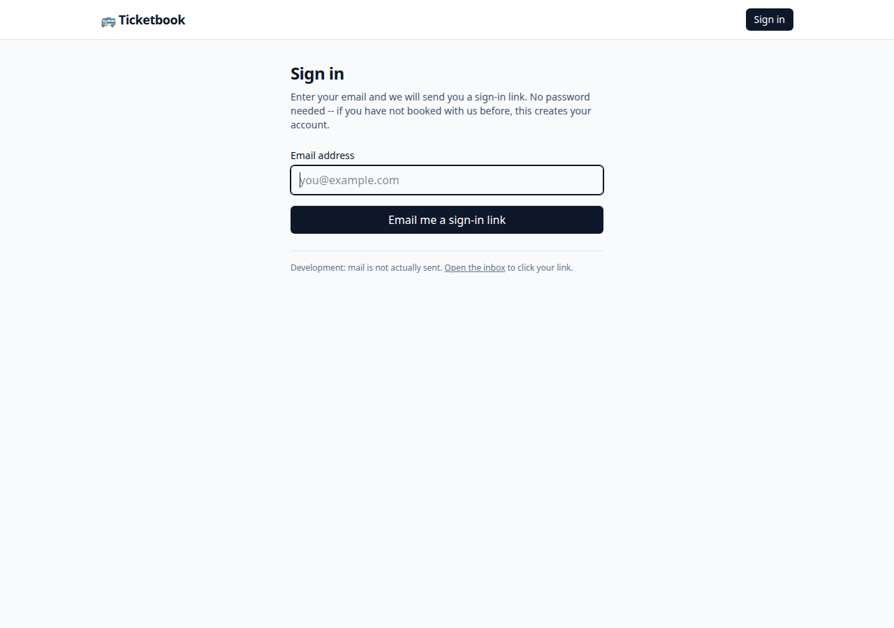

The email arrives in the development inbox:

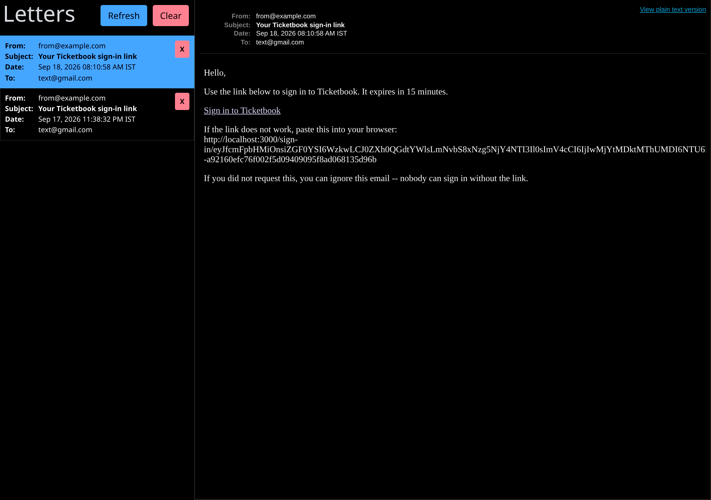

### Search for a bus

Pick where you are going, where from, and when.

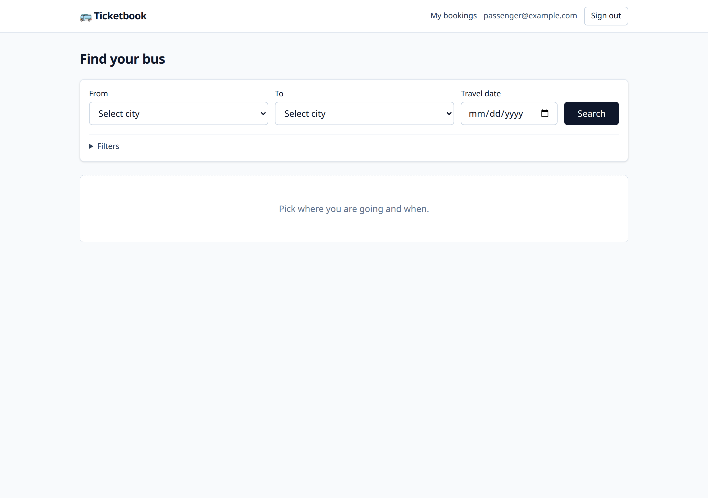

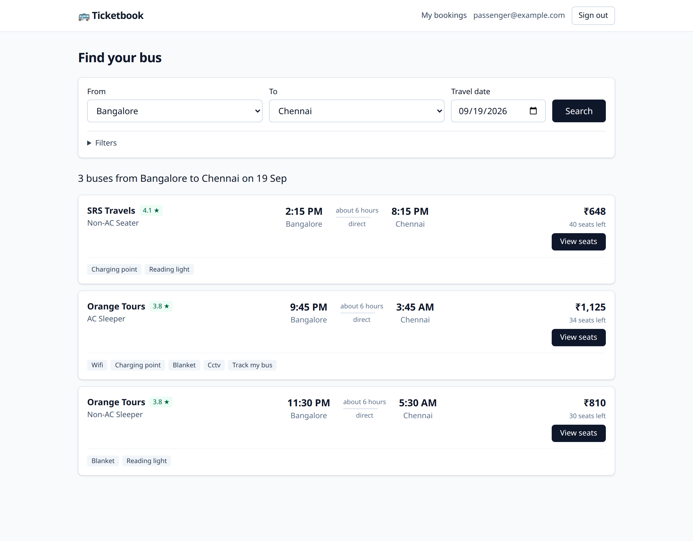

Each result shows the operator and their rating, the departure and arrival
times, the journey length, the type of bus, the amenities, the fare, and how
many seats are still free.

### Narrow it down

You can filter by bus type (AC or Non-AC), seating (sleeper or seater),
operator rating, price range, and amenities — and sort by price, rating,
departure time or journey length.

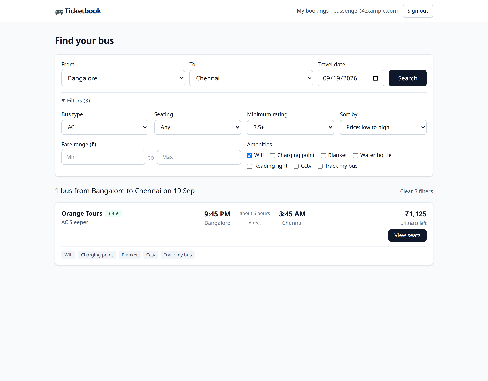

### Pick your seats

Green seats are free, grey seats are taken, dark seats are the ones you picked.
The total updates as you choose. You can take up to 6 seats.

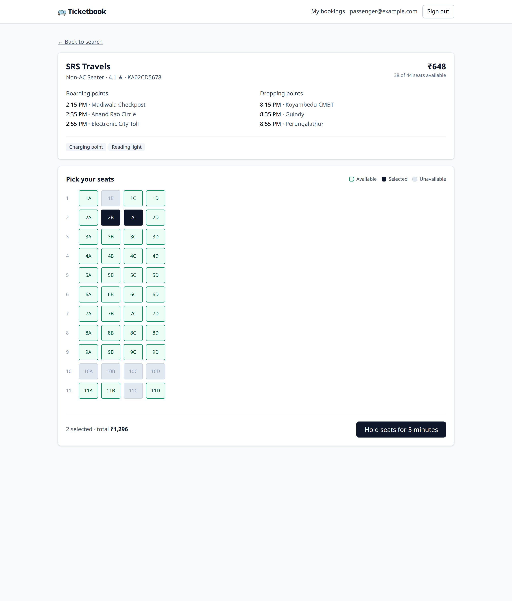

### Your seats are held for 5 minutes

Once you press the button, those seats are yours for five minutes. Nobody else
can take them in that time. A countdown shows how long you have left.

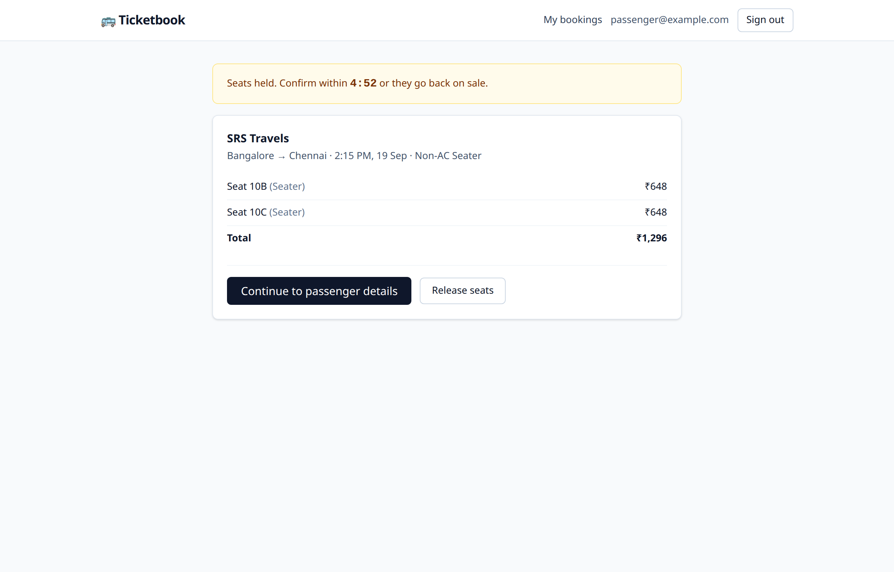

### Enter passenger details

One name per seat, plus the boarding and dropping points for this trip.

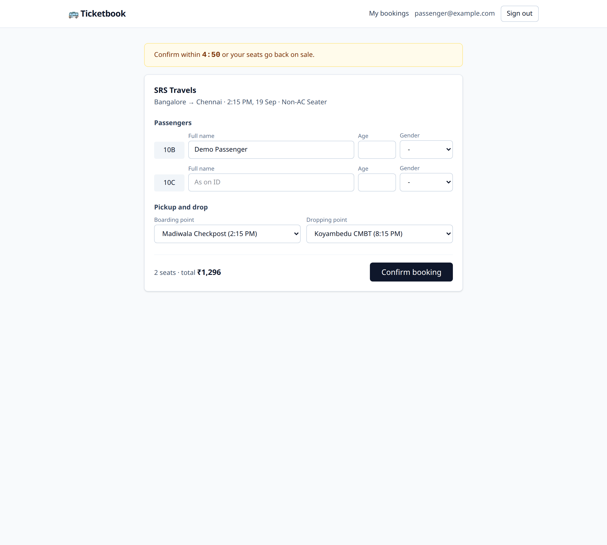

### Get your ticket

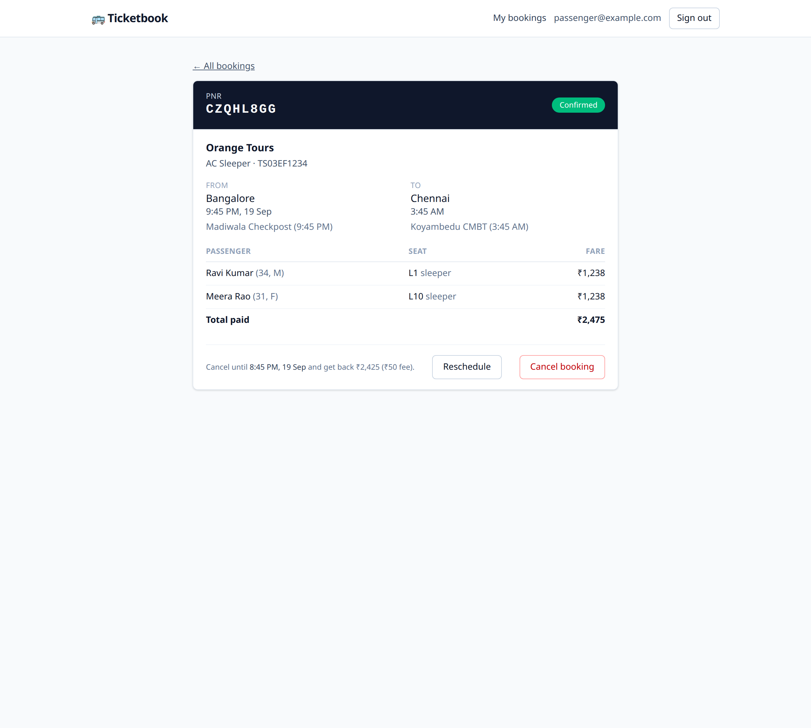

The ticket shows your PNR, the passengers, the seats, the exact boarding point
and time, and how much you get back if you cancel.

### See all your bookings

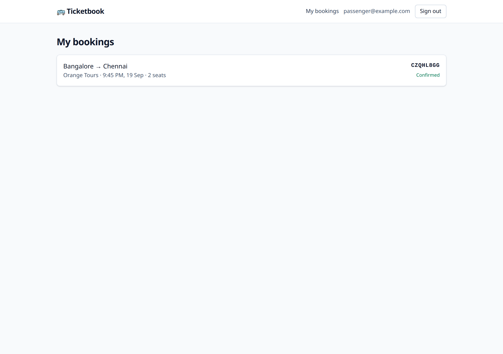

### Move to another bus

You can move a booking to a different departure on the same route with the same
operator. It shows you the price difference before you commit.

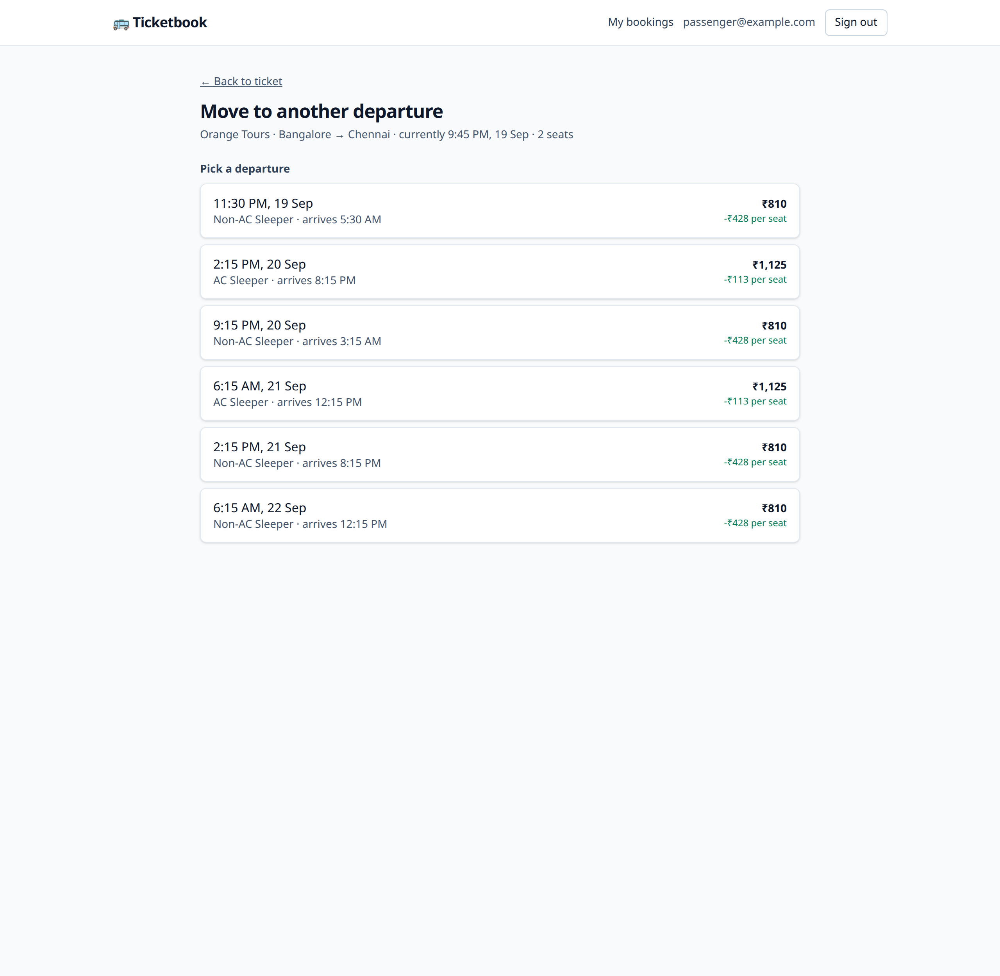

### Background jobs

Each hold gets a job scheduled for the exact second it expires.

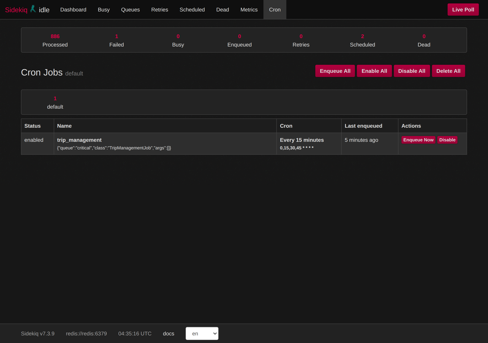

---

## 3. How two people cannot get the same seat

This is the most important part of the app, so here is the plain version first.

**The problem.** Two people tap seat 4A at the same moment. Both computers ask
"is 4A free?" Both get told "yes". Both then write "4A is taken". The seat is
sold twice.

The bug is not that the data is old. The bug is the **gap between asking and
writing**. Someone else can slip in during that gap.

**The fix.** Before asking, we lock the row in the database. The second person
has to wait until the first one has finished. When they finally get in, they see
the seat is already taken.

```ruby
ApplicationRecord.transaction do
  SET LOCAL lock_timeout = '500ms'

  seats = trip.trip_seats.where(id: seat_ids)
              .order(:id)     # always lock in the same order
              .lock           # SELECT ... FOR UPDATE
              .to_a

  return failure(:seats_taken) unless seats.all?(&:claimable?)

  hold = Hold.create!(expires_at: 5.minutes.from_now)
  seats.each { |seat| seat.place_hold! }
end
```

Four things make this safe:

**1. `.lock` — the database makes them queue.**
`SELECT ... FOR UPDATE` tells PostgreSQL: nobody else may touch these rows until
I finish. The second request waits, then reads the *new* state and sees the seat
is gone. There is no moment where both see "free".

**2. `.order(:id)` — so two people never block each other forever.**
If Ravi locks seat 4A then 4B, and Meera locks 4B then 4A, they wait on each
other for ever. That is a deadlock. Sorting by id means everybody locks in the
same order, so the second person simply queues.

**3. `lock_timeout = 500ms` — nobody waits for ever.**
If a lock cannot be taken within half a second, the request gives up and says
"someone is booking that seat right now, please try another". A web server
thread is never held hostage.

**4. A unique index — one seat is one row.**

```ruby
add_index :trip_seats, %i[trip_id seat_number], unique: true
```

Locking protects *a row*. That only protects *a seat* if a seat can never have
two rows. This index guarantees that, and PostgreSQL enforces it no matter what
code runs — a console session, a rake task, a future bug.

### Proof

```
$ bin/rails concurrency:check

TEST 1  12 users, all fighting for seat 10A
        winners: 1   rejected: 11   (302ms)
        reasons: {:seats_taken=>11}
        holds in database: 1
        PASS -- the seat was sold exactly once

TEST 2  overlapping pairs -- the classic deadlock shape
        winners: 1   rejected: 3   deadlocks: 0
        PASS -- ORDER BY id kept them in a queue
```

The same scenario runs in the test suite, so it cannot quietly break later.

### The trade-off in this approach

The guarantee lives in **application code** — a transaction, a row lock, a status
column — rather than in the schema. A future service that updated
`trip_seats.status` *without* taking the lock would bring the bug back, and no
constraint would stop it.

The stronger alternative is a PostgreSQL exclusion constraint, where the database
itself refuses overlapping claims no matter which code asked. I chose the
readable mechanism instead: `.lock` is something any Rails developer can read and
predict on day one, and the 12-thread test proves it holds. At much higher
contention I would move the rule into the database.

---

## 4. How a refresh cannot double-book

**The requirement:** pressing refresh, or double-clicking "Confirm", must not
create two bookings.

**The trick:** a hold can produce **at most one** booking, and the database is
what enforces it.

```ruby
add_index :bookings, :hold_id, unique: true, where: "hold_id IS NOT NULL"
```

Three layers, because each one catches a different case:

**Layer 1 — a quick look before doing anything.**
If a booking already exists for this hold, return it. This handles an ordinary
refresh in a single fast query, with no locking at all.

**Layer 2 — look again after locking.**
Someone else's request may have finished while we were waiting for the lock. We
check again, now that we can trust the answer. *(Without this, a second request
reported "your hold expired" instead of showing the booking that had just been
made — the tests caught it.)*

**Layer 3 — the unique index.**
If two requests somehow both get past the first two checks, PostgreSQL rejects
the second insert. We catch that error and return the first booking.

The result for the user is the same every time: **you get your ticket**. Whether
it was created just now or two seconds ago is invisible.

```
5 sequential confirmations  -> 1 booking, same PNR every time
8 simultaneous confirmations -> 1 booking, 7 replays, 0 errors
```

Bookings are also addressed by PNR rather than database id
(`/bookings/CZQHL8GG`), and every lookup is scoped to the signed-in user, so
somebody else's PNR returns "not found" rather than "forbidden" — which would
have confirmed the booking exists.

---

## 5. How a hold expires

A hold lasts five minutes. Three separate things make sure the seat comes back.

**Layer 1 — the rule itself (cannot fail).**

```ruby
def claimable?(at = Time.current)
  available? || (held? && hold_expires_at <= at)
end
```

A held seat whose time has passed simply **counts as free**, and this is checked
inside the lock. That means the seat is sellable again the instant the five
minutes are up, with no background job involved at all.

**Layer 2 — a job for tidiness.**
When a hold is created, a Sidekiq job is scheduled for the exact second it
expires. It flips the seat back to "available" so the seat map looks right
without waiting for someone to click.

**Layer 3 — a sweeper every 15 minutes.**
`TripManagementJob` picks up anything the job missed — for example if Redis was
cleared or a worker was killed — and also marks departed trips as departed.

**Why this order matters.** Most systems put the rule in the job. Then if the
job never runs, the seat is stuck for ever and cannot be sold. Here the job is
only housekeeping: if Sidekiq is switched off completely, the seat map looks
slightly stale but **every seat is still sellable**. That is why 15 minutes is
often enough for the sweeper, rather than every minute.

The job is also safe to run twice (Sidekiq can deliver a job more than once),
and if it somehow runs early it reschedules itself instead of stealing a hold
that is still alive.

---

## 6. Cancellation and refund

Two rules from the brief:

* You can cancel only if there is **at least 1 hour** left before departure.
* The refund is the **fare minus a flat ₹50**.

```ruby
CANCELLATION_CUTOFF    = 1.hour
CANCELLATION_FEE_PAISE = 5_000

def cancellable?(at = Time.current)
  confirmed? && (departs_at - at) >= CANCELLATION_CUTOFF
end

def projected_refund_paise
  [ total_paise - CANCELLATION_FEE_PAISE, 0 ].max
end
```

`.max` with zero matters: a ₹30 fare refunds ₹0, never minus ₹20.

The ticket tells you the deadline *with the date* before you press anything, and
the confirmation box repeats the exact amount you will get back. Cancelling
releases the seats immediately so somebody else can buy them, and keeps the old
tickets as a record of who was booked.

Cancelling twice is harmless — the second attempt returns the first
cancellation rather than refunding again.

**All money is stored in paise** (₹1,200 is `120000`), as whole numbers. Money
is never a decimal in this codebase, so no rounding can ever go missing.

---

## 7. Rescheduling

You can move a confirmed booking to another departure **on the same route with
the same operator**, up to an hour before the original departure.

The important design decision: it happens in **one database transaction**, not
as "book the new one, then cancel the old one". If it were two steps and the
second one failed, you would end up holding two sets of seats on two buses.
Either the whole swap happens, or nothing happens.

Your passenger names carry across automatically, your boarding point is matched
on the new bus if it stops at the same place, and the two tickets link to each
other so the history is visible. Like confirmation, it is protected by a unique
index — one booking can have at most one replacement.

If the seats you picked are taken while you are choosing, **your original
booking is completely untouched**.

---

## 8. Caching, and how the cache is cleared

Searching is the busiest page and the most expensive query, so the results are
cached. But seat availability changes constantly, so it is **deliberately not**
cached.

**What is cached:** the list of trip ids matching a search — the filtering and
sorting work.

**What is never cached:** how many seats are left. That is counted live from the
database on every page load, with one grouped query for the whole page.

A stale trip list is harmless — the bus still leaves at 9 pm. A stale seat count
makes people angry.

### How the cache is cleared

Not by deleting keys. Deleting means finding every key for every filter
combination, and missing one means someone sees wrong data.

Instead, each route and date has a **version number**:

```ruby
["trip_search", route_id, date, filters_digest, AvailabilityCache.version_for(route, date)]
```

When availability changes, we increase that version number by one:

```ruby
AvailabilityCache.touch!(trip)   # avail:v1:<route>:<date>  ->  4 becomes 5
```

Every old key contains `4`, so nothing can find them any more. Every new lookup
asks for `5` and misses, so it rebuilds. Old entries simply expire on their own.

**The version is bumped when:**

| Event | Why |
|---|---|
| Seats are held | Sold-out state changes |
| A hold expires or is released | Seats come back |
| A booking is confirmed | Seats are gone |
| A booking is cancelled | Seats return |
| A booking is rescheduled | Both trips change |

Each bump happens **after** the database transaction commits, so a rolled-back
booking never invalidates anything.

---

## 9. Database design

12 tables. The interesting ones:

**`trip_seats`** — one row per seat per departure. This is the row that gets
locked, and the whole no-double-booking guarantee rests on it. A seat's status
is `available`, `held`, `booked` or `blocked`.

**`holds`** — a five-minute claim on some seats, by one person.

**`bookings`** — a confirmed purchase, addressed by PNR. It stores its own copy
of the departure time, so editing a trip later cannot change what the passenger
agreed to.

**`tickets`** — one per passenger per seat. These stay for ever, even after a
cancellation, so a seat can have several tickets over its life (one live, the
rest history).

**`trip_stops`** — boarding and dropping points, using single table inheritance
(`BoardingStop` and `DroppingStop`). The same physical place can be a pickup on
one trip and a drop-off on another, and each trip has its own time for it. Using
two classes means the code cannot accidentally store a pickup where a drop-off
belongs — it raises an error instead.

### The database enforces the rules, not just the code

There are **20 check constraints** and 4 important indexes. For example:

```sql
-- a seat marked "held" must say which hold holds it, and until when
status <> 'held' OR (hold_id IS NOT NULL AND hold_expires_at IS NOT NULL)

-- a cancelled booking must record when, and how much was refunded
status <> 'cancelled' OR (cancelled_at IS NOT NULL AND refund_paise IS NOT NULL)

-- a bus cannot arrive before it leaves
arrives_at > departs_at
```

These caught three real bugs while the app was being written, including one
where the code briefly saved a held seat before attaching the hold to it.

---

## 10. How the code is organised

Controllers stay small. Each one turns a web request into one call, and one
answer into one page.

| Folder | Job | Examples |
|---|---|---|
| `app/services` | Things that **change** data, inside a transaction | `SeatHoldService`, `BookingConfirmationService`, `CancellationService`, `RescheduleService`, `HoldReleaseService` |
| `app/queries` | Things that **read** data | `TripSearchQuery` |
| `app/forms` | Checking and tidying user input | `TripSearchForm` |
| `app/jobs` | Work that happens later | `HoldExpiryJob`, `TripManagementJob` |
| `app/models` | One record's own rules | `Trip#bookable?`, `Booking#cancellable?`, `TripSeat#claimable?` |

Every service returns a **Result** rather than raising an error or returning
true/false:

```ruby
result = SeatHoldService.call(user:, trip:, seat_ids:)

if result.success?
  redirect_to result.value
else
  # result.error is :seats_taken, :trip_not_bookable, :too_many_seats ...
end
```

The service decides *what happened*; the controller decides *how to say it*.
That way the same service can be used by the web pages, by the tests, and by any
future API, and they all agree on the rules.

### One rule that shaped a lot of this code

In Rails, **`return` inside a transaction commits it** — it does not undo it.
So every service checks everything *before* writing anything. Getting this wrong
caused a real bug: a failed seat pick was releasing the seats the user already
held. There is now a test for it.

### Front end

Server-rendered pages with Tailwind, plus Hotwire. There are only two small
pieces of JavaScript:

* **seat selection** — tracks which seats you have tapped and updates the total
* **countdown** — shows the time left on your hold

Neither of them decides anything. The server re-checks every seat under a lock,
so even if someone edited the page in their browser, the worst that happens is
the request is rejected.

---

## 11. Tests

```bash
docker compose run --rm web bundle exec rspec
```

```
671 examples, 0 failures
```

The four behaviours the brief asks for specifically:

| What | Where |
|---|---|
| Seat hold creation | `spec/services/seat_hold_service_spec.rb` |
| Expiry logic | `spec/services/seat_hold_service_spec.rb`, `spec/jobs/hold_expiry_job_spec.rb` |
| Double booking prevention | `spec/services/seat_hold_service_spec.rb` (12 real threads), `spec/services/booking_confirmation_service_spec.rb` |
| Cancellation | `spec/services/cancellation_service_spec.rb` |

The concurrency tests use **real threads and real database connections** —
mocking the database would prove nothing, because the database *is* the
mechanism. Those tests turn off the usual "roll back after each test" behaviour
and clean up by truncating instead, because a thread on its own connection
cannot see another thread's uncommitted work.

---
